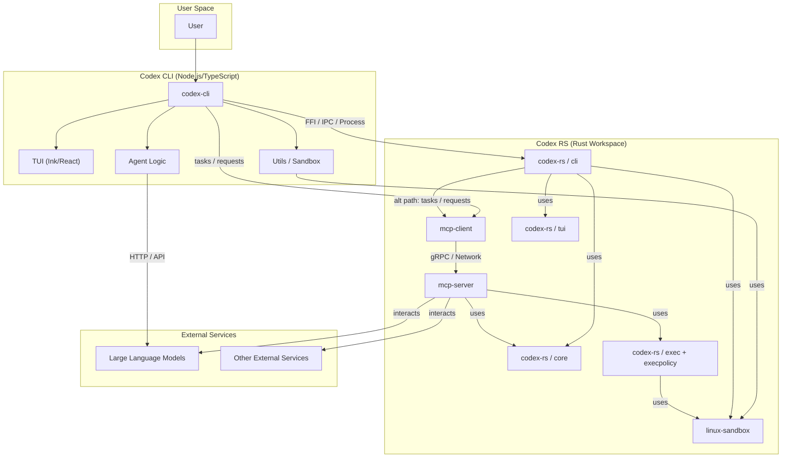
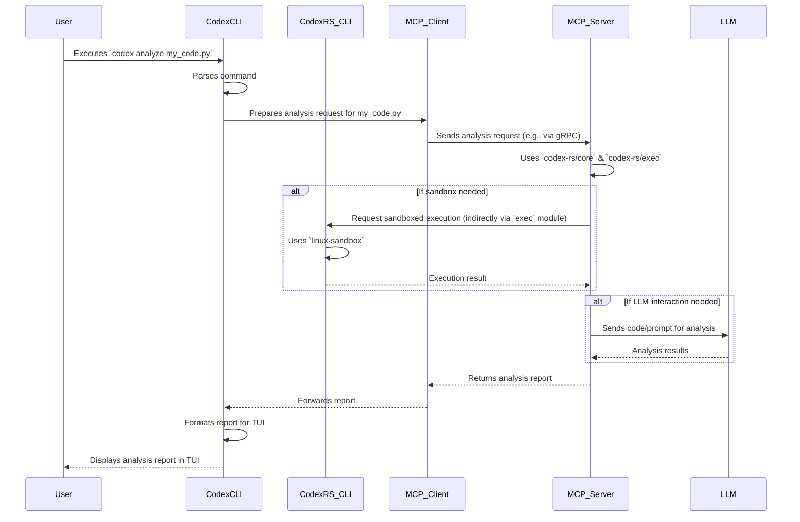

好的，我将为您梳理 `codex` 项目的架构和主要交互。

首先，我们需要了解项目的整体结构。我将列出项目根目录下的主要文件和文件夹，以帮助我们理解项目的组成部分。

Ran tool
从项目结构来看，`codex` 项目主要包含以下几个核心部分：

1.  `codex-cli`: 命令行界面工具，可能是用户与 `codex` 系统交互的主要入口。
2.  `codex-rs`: Rust 实现的核心逻辑或库，可能包含了性能敏感或底层操作的部分。
3.  `.github`: 包含 GitHub Actions 工作流 (workflows) 和问题模板 (ISSUE_TEMPLATE)，用于 CI/CD 和项目管理。
4.  `docs`: 项目文档。
5.  `scripts`: 可能包含一些构建、部署或其他辅助脚本。
6.  `patches`: 可能用于管理第三方库的补丁。
7.  `package.json`, `pnpm-lock.yaml`, `pnpm-workspace.yaml`: 表明这是一个基于 Node.js/pnpm 的 monorepo 项目，`codex-cli` 很可能是一个 Node.js 应用。

接下来，我将使用 `sequential-thinking` 工具来规划如何分析并生成架构图和交互图的描述。

第一步是分析 `codex-cli` 和 `codex-rs` 的内部结构和潜在交互。

Ran tool
抱歉，上一步调用工具时缺少了参数。我会修正并重新开始规划。

我将使用 `sequential-thinking` 工具来规划分析步骤：

Ran tool
接下来，我将更详细地分析 `codex-cli` 的结构，以了解其子组件和潜在的外部交互。

Ran tool
`codex-cli` 目录结构分析：

- `src/`: 存放主要的源代码。
- `components/`: React 组件，表明 `codex-cli` 可能有一个基于文本的用户界面 (TUI) 或某种形式的图形界面渲染。
- `hooks/`: React hooks。
- `utils/`: 工具类函数，其中 `agent/` 目录可能包含与 AI 代理相关的逻辑，`sandbox/` 可能用于执行代码或命令。
- `bin/`: 存放可执行脚本，通常是 CLI 的入口。
- `examples/`: 包含一些示例用法。
- `package.json`: 定义了项目依赖和脚本，可以进一步确认技术栈。
- `tsconfig.json`: 表明这是 TypeScript 项目。
- `Dockerfile`: 用于构建 Docker 镜像。

然后，我将分析 `codex-rs` 的结构。

Ran tool

Ran tool
`codex-rs` 目录结构分析：

- `core/`: 核心逻辑。
- `cli/`: Rust 实现的命令行接口，可能被 `codex-cli` 调用，或者是一个独立的 Rust CLI。其中 `linux-sandbox` 值得注意。
- `mcp-client/` 和 `mcp-server/`: 表明存在一个 MCP (可能是 "Model Control Plane" 或类似的缩写) 客户端和服务器。这暗示了 `codex` 可能有一个客户端-服务器架构，用于模型管理、任务分发等。
- `mcp-types/`: 定义了 MCP 通信所需的数据结构/类型。
- `exec/` 和 `execpolicy/`: 可能与代码执行、沙箱环境和执行策略相关。
- `tui/`: Rust 实现的文本用户界面组件。
- `ansi-escape/`: 处理 ANSI 转义序列的库，常用于 TUI。
- `apply-patch/`: 应用补丁的工具。
- `Cargo.toml`: Rust 项目的配置文件，定义了依赖和工作区成员。

现在，我们可以整合这些信息来描绘整体架构和交互。

Ran tool
根据以上分析，我将尝试描绘 `codex` 项目的架构和主要交互。由于我无法直接生成图像，我将用文本描述这些关系，您可以基于此使用绘图工具（如 Mermaid.js, PlantUML, draw.io 等）来创建可视化图表。

**Codex 项目架构与交互概览**

**核心组件:**

1.  **`codex-cli` (Node.js/TypeScript CLI):**

    - **用户交互层:** 作为用户与 `codex` 系统交互的主要入口。很可能使用 Ink 库构建 TUI，提供丰富的命令行体验。
    - **命令解析与分发:** 解析用户输入的命令，并将任务分发给相应的处理模块。
    - **Agent 逻辑 (`src/utils/agent`):** 可能包含与 AI 代理、大语言模型交互的逻辑。
    - **任务编排:** 协调不同子任务的执行。
    - **与 `codex-rs` 交互:** 可能会通过 FFI (Foreign Function Interface)、子进程调用或 IPC (Inter-Process Communication) 与 `codex-rs` 中的组件（如 `codex-rs/cli` 或 `mcp-client`）交互，以利用 Rust 实现的核心功能。
    - **与 `mcp-server` 交互 (通过 `mcp-client`):** 如果 `codex-cli` 本身不直接调用 `mcp-client` (Rust)，它可能会通过某种机制触发 Rust 端的 `mcp-client` 与 `mcp-server` 通信。

2.  **`codex-rs` (Rust Workspace):**
    - **`core/`:** 包含项目最核心的、与平台无关的业务逻辑和算法。
    - **`cli/`:** Rust 实现的 CLI 工具。
      - **`linux-sandbox/`:** 提供 Linux 环境下的沙箱执行能力，用于安全地运行代码或命令。
      - 可能被 `codex-cli` 调用以执行特定底层任务，或者作为独立的 CLI 工具存在。
    - **`mcp-client/`:** MCP 客户端。
      - 负责与 `mcp-server` 通信，发送请求、接收指令或数据。
      - 可能被 `codex-cli` (间接) 或 `codex-rs/cli` 使用。
    - **`mcp-server/`:** MCP 服务器。
      - **核心服务节点:** 可能是整个系统的中心协调者或任务处理器。
      - 管理模型、处理请求、执行复杂任务。
      - 可能与外部服务 (如 LLM API、数据库等) 交互。
    - **`mcp-types/`:** 定义 `mcp-client` 和 `mcp-server` 之间通信的数据结构和协议 (可能使用如 gRPC, Protobuf, JSON-RPC 等)。
    - **`exec/` & `execpolicy/`:** 提供安全的命令/代码执行能力及其策略管理。可能与 `cli/linux-sandbox/` 紧密相关。
    - **`tui/`:** Rust 实现的 TUI 组件，可能被 `codex-rs/cli` 使用，或者为 `codex-cli` 提供更底层的 TUI 渲染能力。
    - **`common/`:** 通用库，被 `codex-rs` 内其他 crates 共享。
    - **`apply-patch/`, `ansi-escape/`:** 辅助工具库。

**主要交互流程 (推测):**

1.  **用户 -> `codex-cli`:**

    - 用户通过命令行启动 `codex-cli` 并输入指令 (例如，代码分析、代码生成、执行任务等)。

2.  **`codex-cli` 内部处理:**

    - `codex-cli` 解析命令。
    - 对于简单任务或 UI 展示，`codex-cli` (及其 React/Ink TUI) 可能直接处理。
    - 对于需要核心功能或底层操作的任务：
      - `codex-cli` 可能通过 FFI 或子进程调用 `codex-rs/cli` 中的特定功能 (如沙箱执行)。
      - `codex-cli` 中的 `agent` 模块可能准备与 LLM 交互的请求。

3.  **`codex-cli` -> `mcp-client` -> `mcp-server` (核心业务流):**

    - `codex-cli` (或其触发的 `codex-rs/cli`) 将任务请求封装后，通过 `mcp-client` (Rust) 发送给 `mcp-server`。
    - 请求内容可能包括：要分析的代码、要执行的指令、用户配置等。
    - 通信协议由 `mcp-types` 定义。

4.  **`mcp-server` 处理:**

    - `mcp-server` 接收请求，根据请求类型进行处理。
    - 可能涉及：
      - 调用 `codex-rs/core` 中的核心逻辑。
      - 使用 `codex-rs/exec` 和 `codex-rs/execpolicy` (及 `linux-sandbox`) 安全执行代码或命令。
      - 与外部大语言模型服务交互。
      - 将任务分解并分发给其他可能的 worker (如果架构支持)。
    - 处理结果通过 `mcp-client` 返回给请求方。

5.  **结果返回与展示:**
    - `codex-cli` 接收来自 `mcp-server` (通过 `mcp-client`) 或 `codex-rs/cli` 的结果。
    - 将结果格式化并在 TUI 中展示给用户。

**架构图描述 (Mermaid.js 示例):**

您可以尝试使用类似以下的 Mermaid.js 语法来绘制架构图：

**交互图描述 (Mermaid.js Sequence Diagram 示例):**

以下是一个简化的用户执行代码分析任务的交互示例：

**总结与建议:**

- **`codex-cli`** 是前端和用户交互层，负责命令处理和展示。
- **`codex-rs`** 提供了核心的后端功能、安全执行环境以及可能的客户端-服务器架构 (`mcp-client`/`mcp-server`) 用于处理复杂任务和与外部服务（如 LLM）的集成。
- **MCP (Model Control Plane?)** 似乎是系统的关键部分，用于协调和执行核心任务。
- **沙箱 (`linux-sandbox`)** 强调了安全执行代码的重要性。

您可以根据这个描述，结合您对项目的更深入理解，来绘制更精确和详细的架构图和交互图。如果需要针对特定模块或流程进行更细致的分析，请告诉我。

Ran tool

Ran tool
我已经根据对项目结构的分析，为您提供了 `codex` 项目的详细架构和主要交互流程的文字描述，并且给出了使用 Mermaid.js 语法的示例，您可以基于这些描述来绘制图表。

总结一下关键点：

- **分层架构**: 用户通过 `codex-cli` (Node.js/TypeScript TUI) 进行交互，核心功能和底层操作由 `codex-rs` (Rust) 提供。
- **核心组件**:
  - `codex-cli`: 用户界面、命令解析、任务初步处理、Agent 逻辑。
  - `codex-rs`: 包含 `core` (业务逻辑)、`cli` (Rust CLI)、`exec` (安全执行)、`mcp-client`/`mcp-server` (客户端/服务器模型，可能用于任务调度、与 LLM 通信等)。
- **关键交互**:
  - 用户指令通过 `codex-cli` 传递。
  - `codex-cli` 可能直接调用 `codex-rs` 的部分功能 (如 `codex-rs/cli`) 或通过 `mcp-client` 与 `mcp-server` 通信。
  - `mcp-server` 可能是核心任务处理和外部服务（如 LLM）集成的中枢。
  - 代码执行的安全性通过 `linux-sandbox` 和 `execpolicy` 等机制保障。

如果您希望深入了解特定模块的交互细节，或者有其他需要澄清的地方，请随时提出。

Ran tool
