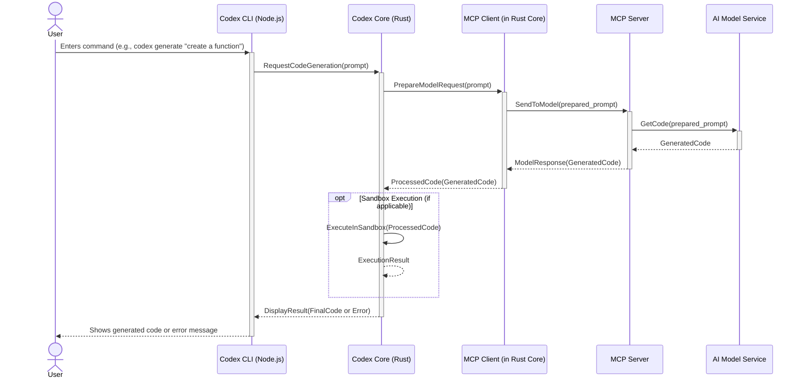

好的，我们来梳理一下 `codex` 项目的架构和主要交互流程，并用图表来展示。

这是一个复杂任务，我将分步骤进行：

1.  **分析项目结构**：理解项目的核心组件和它们之间的潜在关系。
2.  **设计架构图**：使用 Mermaid 语法绘制一个高层次的组件图，展示主要模块及其职责。
3.  **设计交互图**：针对一个典型的用例（例如，用户通过 CLI 执行一个代码分析或生成任务），使用 Mermaid 语法绘制序列图，展示组件间的消息传递。
4.  **生成图像**：将 Mermaid 代码转换为图片。

我将使用 `sequential-thinking` 工具来规划和跟踪这些步骤。

第一步，我将设定一个初步的思考计划。

Ran tool
看起来 `sequential-thinking` 工具当前不可用。我会继续进行，并尽力完成任务。

**1. 分析项目结构 (已在我的思考过程中进行)**

根据您提供的项目结构，我识别出以下关键部分：

- **`codex-cli` (Node.js/TypeScript)**:
  - 用户交互层，提供命令行界面。
  - 包含 `chat` 组件、`onboarding`、`select-input` 等 UI 相关元素。
  - `agent/sandbox`: 表明有代码执行沙箱的能力。
  - `utils/singlepass`: 可能是一种特定的处理或分析流程。
- **`codex-rs` (Rust)**:
  - 核心后端逻辑，包含多个 crate (子项目)。
  - `core`: 核心功能实现。
  - `cli`: Rust 版本的 CLI 工具或与 `codex-cli` 的接口。
  - `exec`, `execpolicy`: 代码执行和策略控制。
  - `mcp-client`, `mcp-server`, `mcp-types`: 模型控制平面 (MCP) 的组件，用于与 AI 模型或其他服务交互。
  - `tui`: 终端用户界面 (Text User Interface) 组件。
- **`.github/workflows`**: CI/CD 流程，定义了构建、测试和部署。
- **`docs`**: 项目文档。
- **`examples`**: 示例项目，展示 `codex` 的用法。

**2. 设计架构图**

我将设计一个高层次的组件图，展示这些主要部分如何组织在一起。

**架构图 Mermaid 代码 (初步设计):**

```mermaid
graph LR
    subgraph User Interaction
        User((User))
    end

    subgraph Codex CLI [codex-cli (Node.js/TypeScript)]
        direction LR
        CLIInterface[CLI Interface]
        AgentSandbox[Agent Sandbox]
        UIComponents[UI Components e.g., Chat]
    end

    subgraph Codex Core [codex-rs (Rust)]
        direction TB
        CoreLogic[Core Logic]
        RustCLI[Rust CLI Bridge]
        Executor[Executor & Policy]
        TUI[Terminal UI]
        MCPClient[MCP Client]
    end

    subgraph Model Control Plane (MCP)
        direction TB
        MCPServer[MCP Server]
        ModelServices[AI Model Services / External APIs]
    end

    User -- Interacts via Terminal --> CLIInterface
    CLIInterface -- Commands/Input --> AgentSandbox
    CLIInterface -- Manages --> UIComponents
    CLIInterface -- Invokes --> RustCLI

    RustCLI -- Relays to --> CoreLogic
    CoreLogic -- Uses --> Executor
    CoreLogic -- Can use --> TUI
    CoreLogic -- Interacts via --> MCPClient
    MCPClient -- Requests --> MCPServer
    MCPServer -- Accesses --> ModelServices
    AgentSandbox -- May interact with --> CoreLogic

    classDef user fill:#f9f,stroke:#333,stroke-width:2px;
    classDef cli fill:#bbf,stroke:#333,stroke-width:2px;
    classDef rustcore fill:#fb9,stroke:#333,stroke-width:2px;
    classDef mcp fill:#9f9,stroke:#333,stroke-width:2px;

    class User user;
    class CLIInterface,AgentSandbox,UIComponents cli;
    class CoreLogic,RustCLI,Executor,TUI,MCPClient rustcore;
    class MCPServer,ModelServices mcp;
```

这张图描绘了用户如何通过 `codex-cli` 与系统交互。`codex-cli` 内部包含命令行接口、一个可能的代理沙箱和UI组件。它会调用 `codex-rs` (Rust核心) 的功能，Rust核心包含核心逻辑、执行器、终端UI能力以及一个 MCP 客户端。MCP 客户端再与 MCP 服务器通信，后者可能连接到外部的 AI 模型服务。

**3. 设计交互图 (以 "代码生成" 为例)**

现在，我将设计一个序列图，展示当用户请求代码生成时，系统内部的典型交互流程。

**交互图 Mermaid 代码 (初步设计):**



这个序列图展示了：

1.  用户通过 CLI 发起代码生成请求。
2.  CLI 将请求传递给 Rust 核心。
3.  Rust 核心通过 MCP 客户端与 MCP 服务器通信。
4.  MCP 服务器调用 AI 模型服务。
5.  结果逐级返回，Rust 核心可能会在沙箱中执行或进一步处理代码。
6.  最终结果通过 CLI 展示给用户。

**4. 生成图像**

现在我将使用这些 Mermaid 代码来生成 PNG 图像。

我先生成架构图。

Ran tool
Mermaid 服务当前似乎也不可用。

在这种情况下，我无法直接生成图像。不过，我已经提供了 Mermaid 格式的图表定义。您可以将这些代码片段复制到任何支持 Mermaid 的在线编辑器或本地工具 (例如 Mermaid Live Editor, VS Code 插件, Typora, Obsidian 等) 中自行渲染它们。

**架构图 Mermaid 代码:**

```mermaid
graph LR
    subgraph User Interaction
        User((User))
    end

    subgraph Codex CLI [codex-cli (Node.js/TypeScript)]
        direction LR
        CLIInterface[CLI Interface]
        AgentSandbox[Agent Sandbox]
        UIComponents[UI Components e.g., Chat]
    end

    subgraph Codex Core [codex-rs (Rust)]
        direction TB
        CoreLogic[Core Logic]
        RustCLI[Rust CLI Bridge]
        Executor[Executor & Policy]
        TUI[Terminal UI]
        MCPClient[MCP Client]
    end

    subgraph Model Control Plane (MCP)
        direction TB
        MCPServer[MCP Server]
        ModelServices[AI Model Services / External APIs]
    end

    User -- Interacts via Terminal --> CLIInterface
    CLIInterface -- Commands/Input --> AgentSandbox
    CLIInterface -- Manages --> UIComponents
    CLIInterface -- Invokes --> RustCLI

    RustCLI -- Relays to --> CoreLogic
    CoreLogic -- Uses --> Executor
    CoreLogic -- Can use --> TUI
    CoreLogic -- Interacts via --> MCPClient
    MCPClient -- Requests --> MCPServer
    MCPServer -- Accesses --> ModelServices
    AgentSandbox -- May interact with --> CoreLogic

    classDef user fill:#f9f,stroke:#333,stroke-width:2px;
    classDef cli fill:#bbf,stroke:#333,stroke-width:2px;
    classDef rustcore fill:#fb9,stroke:#333,stroke-width:2px;
    classDef mcp fill:#9f9,stroke:#333,stroke-width:2px;

    class User user;
    class CLIInterface,AgentSandbox,UIComponents cli;
    class CoreLogic,RustCLI,Executor,TUI,MCPClient rustcore;
    class MCPServer,ModelServices mcp;
```

**交互图 (代码生成示例) Mermaid 代码:**


这些图表代表了我对 `codex` 项目架构和关键交互的理解。它们是基于项目结构和通用设计模式推断出来的。如果需要更详细或针对特定子模块的图表，请告诉我。
